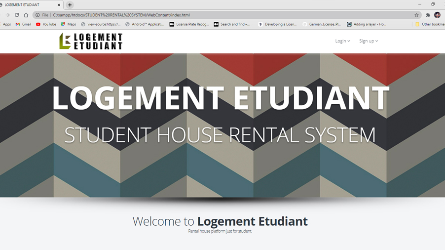
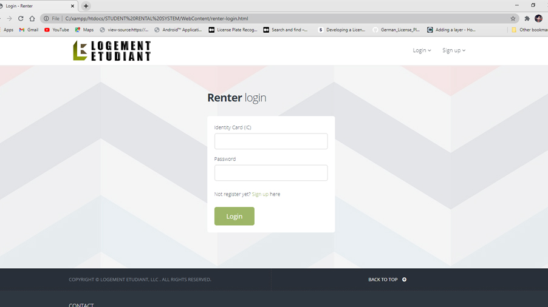
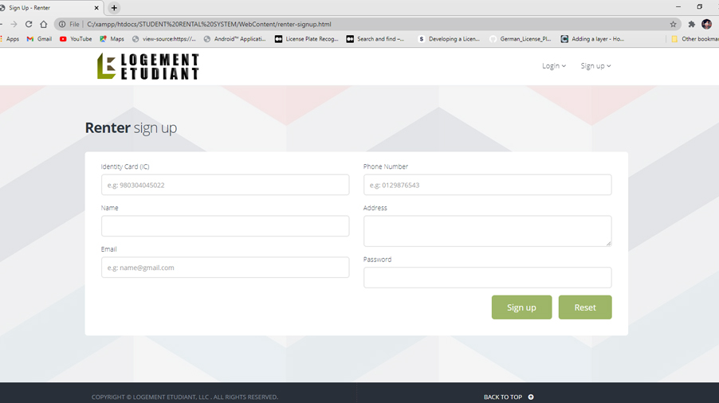

# Student-House-Rental-System-using-Java-MVC-Architecture

#### Logement Etudiant is a student house rental system for UiTM students in Jasin and Merlimau areas. The system will involved two user which are student and renter. Renter can add their house details into the system to advertise their rental businesses. Student can log into their account to find and compare rent house in the system. The system also provide a feature to log their payment every month. Java MVC architecture and Database Oracle are used to develope the system.

